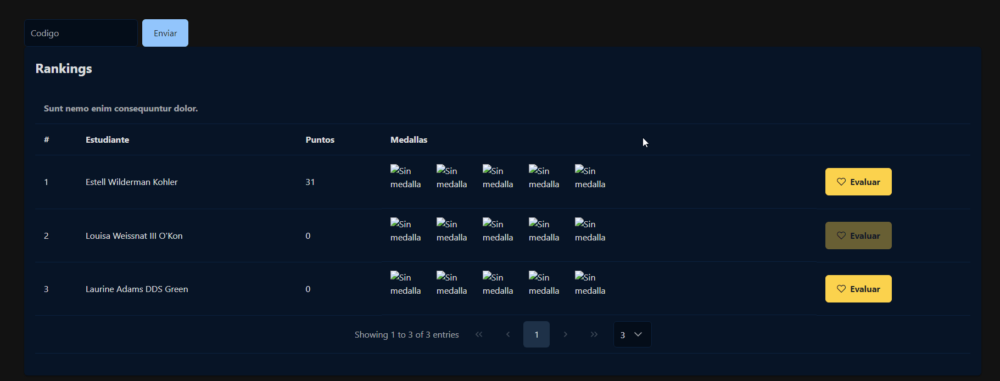
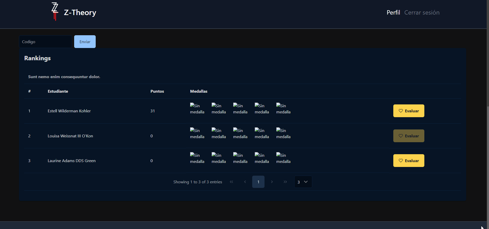
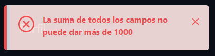

# Evaluar

En esta parte de la aplicación, los alumnos podrán evaluarse entre sí, repartiendo sus **1000 kudos semanales**. El mismo estudiante, jamás podrá evaluarse a sí mismo.

Si el usuario quiere saber más información acerca de las **soft skills** puede dar click en las medallas y le saldrá un modal con la información sobre las habilidades.

## Soft Skills

## Evaluar

Ahí habrá un pequeño formulario donde pueda poner los kudos que el alumno quiera introducir para ese alumno. Si el alumno intenta dar más de sus 1000 kudos, la aplicación le retornará un error diciendo que la suma de todos los campos no puede dar más de 1000.

