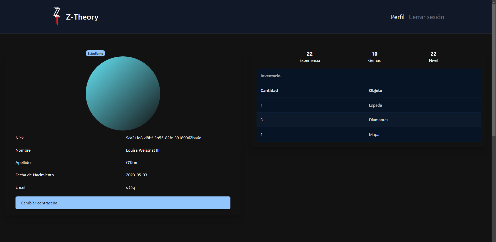
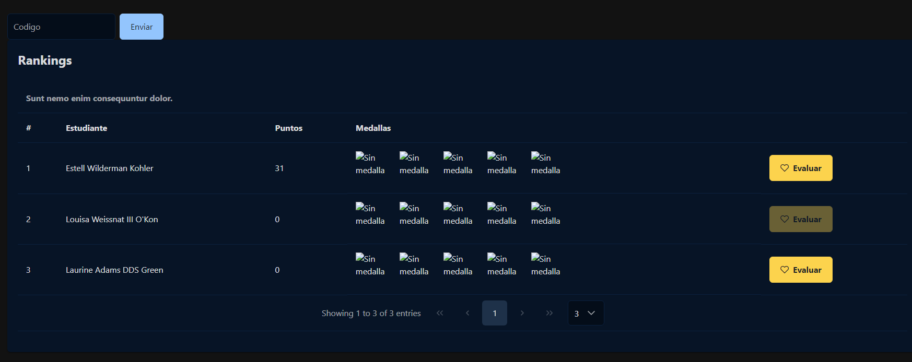
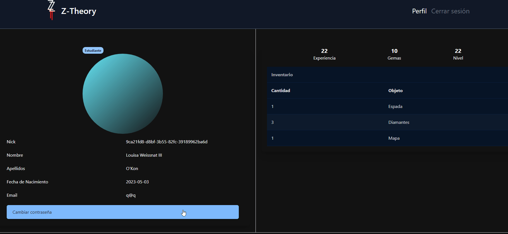

# Perfil

El estudiante constaría como un usuario normal. Sin ningún tipo de permiso de eliminación como tal. Únicamente podrá cambiar su contraseña, entregar tareas o bien evaluar a sus compañeros.

Si el usuario baja un poco más por su perfil, encontrará a los rankings que pertenece.

Dentro de este ranking, podrá evaluar a sus compañeros dandoles puntos para las **Soft skills**

## Cambiar contraseña

El usuario deberá poner su contraseña anterior y poner la nueva para un cambio de contraseña exitoso.

