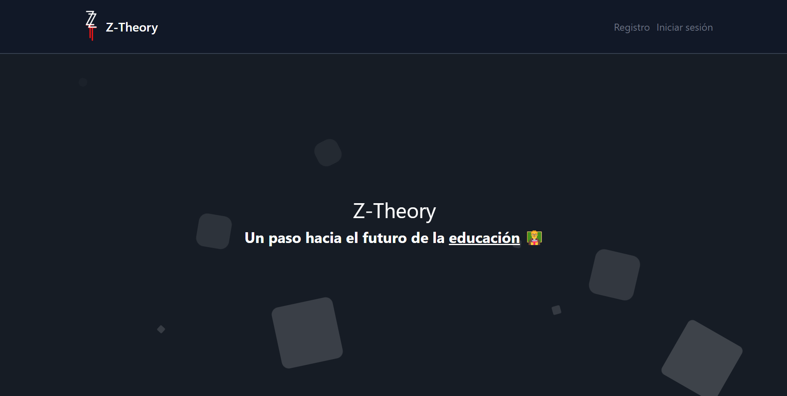
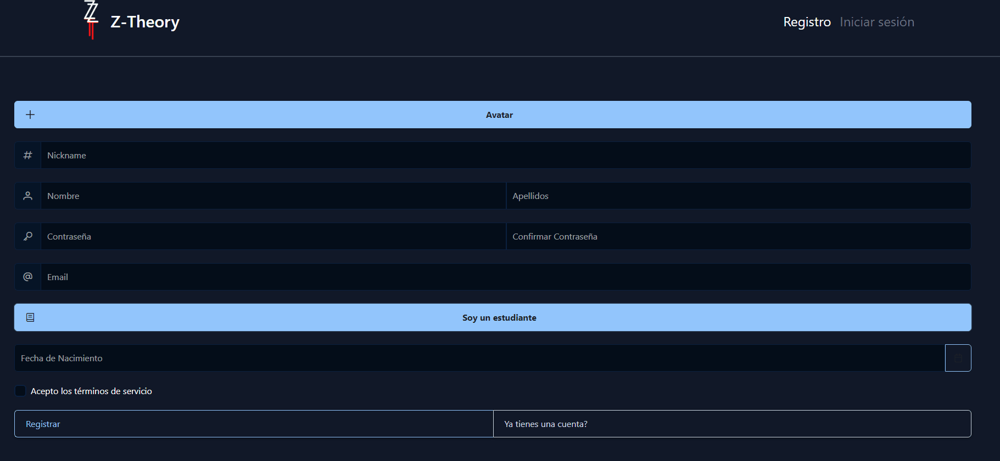
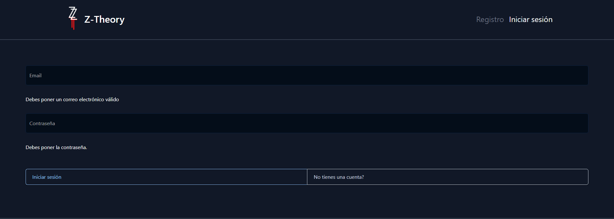

# Manual del Usuario

Una vez instalado correctamente el proyecto y que este se esté sirviendo, deberás aprender a usar la aplicación web. Lo primero que te encontrarás es:

{ loading=lazy }

Esa es la página principal. Cómo podrás observar hay dos acciones que puede hacer el usuario. Puede tanto **```Iniciar Sesión```** como **```Registrarse```**.

---

## Registro

Una vez entres dentro del apartado de registro encontraras un formulario con varios campos para rellenar con datos.
Aquí un dato a destacar es la opción de **soy un estudiante** si das click en esa opción cambiarás a la de ser **profesor** como podrás ver aquí:

{ loading=lazy }


La opción que cambia cuando te registras como profesor o alumno es que en el alumno le pide la fecha de nacimiento mientras que en el profesor le pide el nombre de su centro educativo.
Si el usuario ya tiene cuenta, puede dar click en la opción de **```¿Ya tienes una cuenta?```** para que le lleve al formulario de iniciar sesión.

---

## Iniciar sesión
Una vez entres dentro del apartado de Iniciar sesión encontrarás un formulario con varios campos para rellenar con datos.
{ loading=lazy }
Si el usuario no tiene una cuenta puede optar por dar click en la opción de **```¿No tienes una cuenta?```** y le llevará al formulario de registro.
