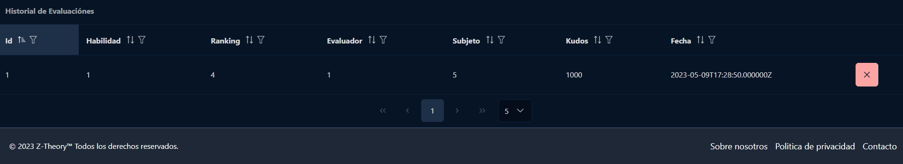

# Historial

Dentro de esta página el profesor podrá gestionar todas las evaluaciones que el alumnado ha creado entre sí. Es decir, podrá mirar
quien la creó a quién le dió los puntos, cuantos puntos le dió y la fecha en la que lo hizo. También podrá filtrarlo como más cómodo le sea más comodo. 

## Eliminación de evaluación

