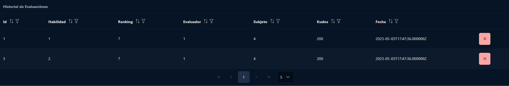

# Historial

Dentro de esta página el profesor podrá gestionar todas las evaluaciones que el alumnado ha creado entre sí. Es decir, podrá mirar
quien la creó a quién le dió los puntos, cuantos puntos le dió y la fecha en la que lo hizo. El profesor podrá borrar en cualquier momento la evaluación creada por el alumno y los puntos se restaran.

Dentro de ahí los **kudos** se refiere a los puntos que tiene el alumno en total. Si el profesor quisiera eliminar el historial, aparecería antes una advertencia de confirmación para evitar eliminar registros no deseados.
