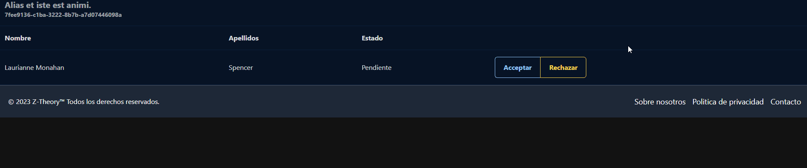

# Rankings

Dentro de esta parte, el profesor podrá gestionar la entrada a los rankings de los alumnos ya que antes de poder acceder a algún ranking, deberán ser aceptados por el profesor para formar parte de ese ranking. El profesor podrá aceptar o denegar al alumno si así lo desea.

## Aceptar alumnos

{ loading=lazy }

Volviendo al perfil del profesor. Podrá gestionar todo el sistema de rankings desde ahí.

## Ranking

{ loading=lazy }

Desde aquí podrá; borrar alumnos, añadir entregas, modificar el nombre del ranking,cambiar el código del y eliminar el ranking.

## Crear

{ loading=lazy }

## Cambio de nombre.

{ loading=lazy }

## Eliminación del estudiante.

Deberá refrescar la página para ver el resultado.
{ loading=lazy }

## Refrescar código.

{ loading=lazy }

Para poder añadir estudiantes al ranking, deberá darle click al código para que se le copie al portapapeles. Luego, podrá pasarle ese código a los alumnos para que se vayan uniendo.
