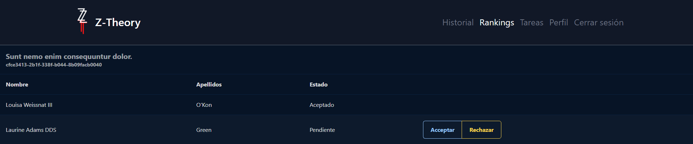
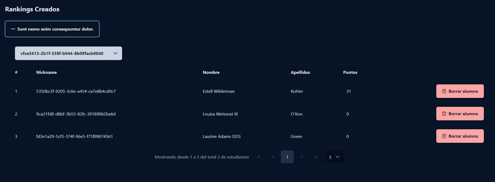
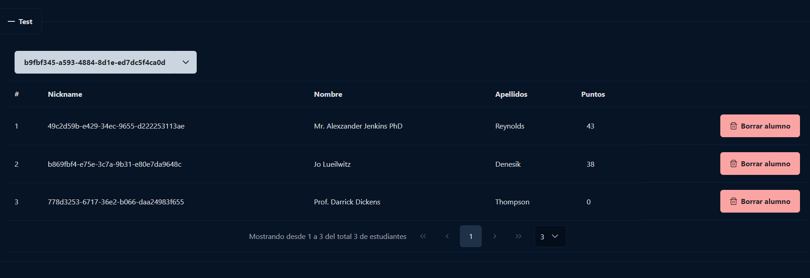
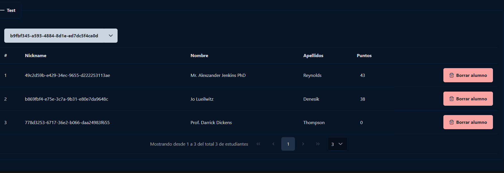
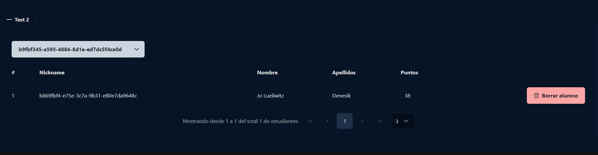
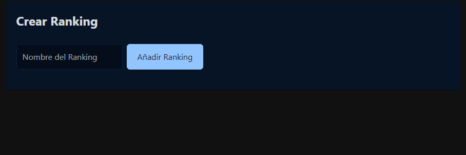

# Rankings

Dentro de esta parte, el profesor podrá gestionar la entrada a los rankings de los alumnos ya que antes de poder acceder a algún ranking, deberán ser aceptados por el profesor para formar parte de ese ranking. El profesor podrá aceptar o denegar al alumno si así lo desea.

Volviendo al perfil del profesor. Podrá gestionar todo el sistema de rankings desde ahí.

Desde aquí podrá; borrar alumnos, añadir entregas, modificar el nombre del ranking,cambiar el código del y eliminar el ranking.

Cambio de nombre al ranking

Eliminación del estudiante del ranking

Refrescar código del ranking

Para poder crear un ranking deberá ir a su perfil y darle un nombre. Acto seguido, deberá dar click en **Añadir Ranking**. Para verlo únicamente deberá bajar un poco por su perfil y se lo mostrará en el apartado de **Rankings creados**.

Para poder añadir estudiantes al ranking, deberá darle click al código para que se le copie al portapapeles. Luego, podrá pasarle ese código a los alumnos para que se vayan uniendo.
