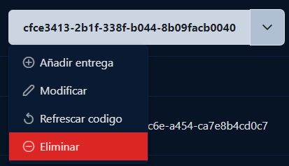
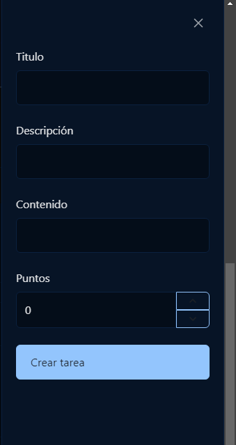
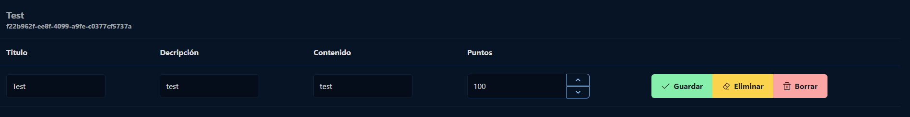

# Tareas

Para poder crear tareas, primero deberá asignarlas al ranking. 

Una vez le de click a **Añadir entrega** aparecerá en la parte derecha un formulario para la creación de la entrega.

El profesor deberá de rellenar el formulario para que los alumnos puedan crear la entrega. Deberá añadir un **Titulo**, una **descripción**, un **contenido** y asignar los **puntos** que obtendrá el alumno tras completarla.

Una vez creada la tarea, deberá ir al apartado de **Tareas** que tiene en su perfil para poder gestionar la tarea.

El profesor podrá modificar la tarea a su gusto. Tanto eliminar la tarea de ese ranking o bien eliminarla **definitivamente**.